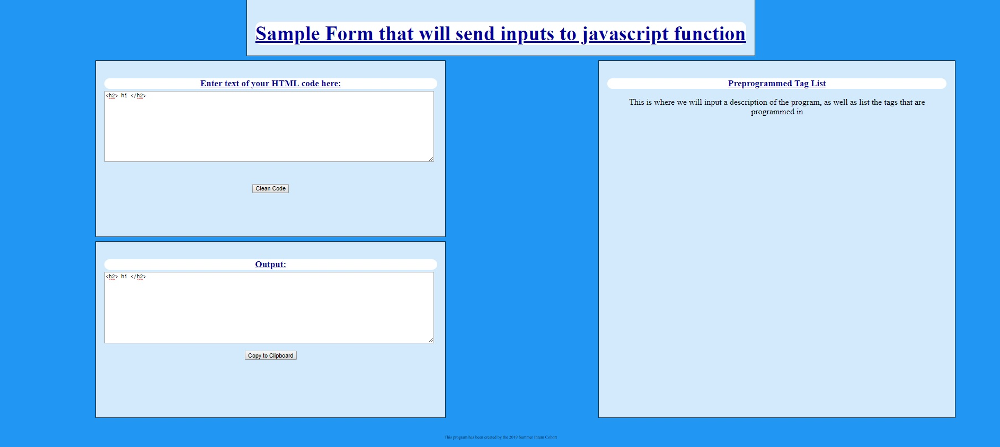

Junk Tag Removal
============

This is an application that utilizes HTML, Javascript and CSS to remove certain HTML tags that are specific to Sharepoint styling.

---

## Features
- Input text HTML
- Removes  and <script> tags
- Removes style= and class= attributes
- Removes comments
- Returns new version of text HTML without the above elements
- Simple interface
  
  ---
  
## Setup
Download the JunkTagRemoval.html and myStyle.css files.  As of right now, the application is only being run locally through Notepad.  Right-click on the JunkTagRemoval.html file and Open With NotePad.  This will allow you to view the code for the application.  To run the application, Open With Google Chrome instead of with NotePad.

---

## Usage
Feel free to test out the application with as many different texts as you want!  Paste the text HTML from which you would like to remove junk tags in the top left box.  After clicking the "Clean Code" button, the bottom left box will now contain an updated version of your input without certain tags.
